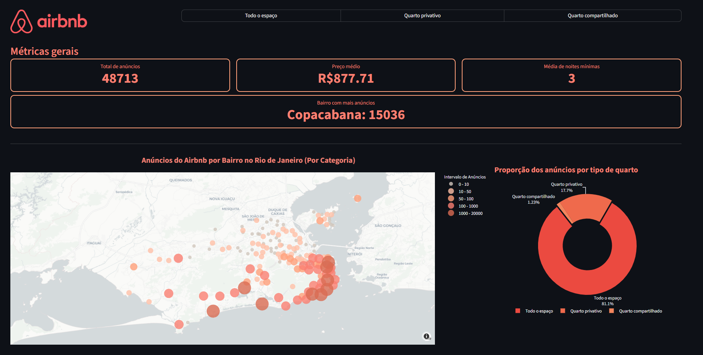

# Airbnb Listing Price & Rating Prediction
### Languages & Core:


This repository contains an end-to-end data science pipeline focused on data cleaning, exploratory analysis, and building predictive models to forecast both **listing prices** and **user ratings** across global markets.

# Directory Tree: AirBnb
```
📂 Air-BnB
├── 📂 data
│   ├── 📄 AirBnBLimpo_London.csv
│   ├── 📄 AirBnBLimpo_New-york-city.csv
│   └── 📄 AirBnBLimpo.csv
├── 📂 notebooks
│   ├── 📓 01_rio_de_janeiro_analysis.ipynb
│   ├── 📓 02_world_cities_analysis.ipynb
│   └── 📝 readme.md
├── 📂 src
├── 🐍 app.py (work in progress)
└── 📝 README.md
```

## Dashboard
<a href="https://airbnb-felipe.streamlit.app/" target="_blank">
  
</a>

## Project Scope
The analytical pipeline is split into two distinct execution environments to handle regional data variations:
* **Rio de Janeiro:** A localized study analyzing 40,769 entries. This pipeline includes robust data cleaning, outlier removal, and localized risk-assessment features (such as neighborhood safety metrics).
* **Global Cities:** A generalized pipeline built to scale across other cities worldwide. It maintains the core analytical structure but bypasses the specific Rio cleaning steps to respect unique global data distributions ($R^2$ performance ranges consistently from 0.40 to 0.60).

## Key Features
* **Data Cleaning & Preprocessing:** Handling missing values, targeted outlier filtering, and domain-specific feature engineering.
* **Exploratory Data Analysis (EDA):** Visualizations mapping out key market trends, geographical pricing concentrations, and feature correlations.
* **Segmented Price Prediction:** Regression modeling built dynamically around property room types to capture varying market mechanics.
* **Rating Modeling (WIP):** Benchmarking framework comparing multiclass classification vs. regression architectures to predict user satisfaction.

## Model Performance (Rio de Janeiro)

To predict listing prices, models were trained on the cleaned data and benchmarked against a Dummy Regressor baseline ($R^2 \approx 0.00$). Advanced algorithms like **XGBoost** and **Decision Trees** significantly outperformed baseline and linear shrinkage methods (**Lasso**).

### Overall Performance (Cleaned Dataset)
* **XGBoost Regressor:** $R^2 = 0.5956$
* **Decision Tree Regressor:** $R^2 = 0.3987$

### Segmented Analysis by Room Type
Market dynamics shift heavily based on the type of accommodation. Segmenting the data revealed that entire properties are far more predictable than shared spaces:

| Room Type | Decision Tree ($R^2$) | XGBoost ($R^2$) |
| :--- | :---: | :---: |
| **Entire home/apt** | 0.4311 | **0.5365** |
| **Private room** | 0.0814 | **0.0492** |
| **Shared room** | 0.0054 | **0.0167** |

## Performance & Load Testing (AWS Lambda)

The global XGBoost model was deployed as a serverless function on **AWS Lambda** and subjected to a load test using **Locust** to evaluate its behavior, throughput, and latency under continuous traffic. 

The inference pipeline loads the trained model using `joblib` inside the Lambda environment.

### 📊 Test Configuration & Environment
* **Infrastructure:** AWS Lambda
* **Deployment Packaging:** Trained XGBoost model loaded via `joblib`
* **Load Testing Tool:** Locust
* **Simulated Users:** 20 maximum concurrent users
* **Spawn Rate:** 2 users/second

---

### Load Test Results & Metrics

The pipeline successfully handled continuous traffic with **zero failures** under the simulated load. Below are the key performance indicators extracted from the test run:

#### Request Statistics
| Type | Endpoint | Total Requests | Failures | Average Latency | Min Latency | Max Latency (Cold Start) | Throughput (RPS) |
| :--- | :--- | :---: | :---: | :---: | :---: | :---: | :---: |
| **POST** | `/predict` | **5,582** | **0** | **57.79 ms** | **31 ms** | **4,601 ms** | **9.67 req/s** |

#### Response Time Percentiles (Latency Distribution)
| 50% (Median) | 60% | 70% | 80% | 90% | 95% | 99% | 100% ($p_{100}$) |
| :---: | :---: | :---: | :---: | :---: | :---: | :---: | :---: |
| **43 ms** | 46 ms | 50 ms | 56 ms | 81 ms | 110 ms | 130 ms | **4,600 ms** |

---

### Key Findings & Production Insights

1. **Ultra-Low Steady State Latency:** In steady-state conditions, the model demonstrates exceptional performance. The median latency ($p_{50}$) is only **43 ms**, and even at the 99th percentile ($p_{99}$), the response time stays low at **130 ms**.
2. **The Cold Start Phenomenon:** The maximum recorded latency reached **4.6 seconds** ($p_{100}$). As clearly shown in the *Response Times* chart, this was an isolated spike at the very beginning of the test window, directly corresponding to the initial AWS Lambda container provisioning (Cold Start) and the overhead of loading the `joblib` model into memory.
3. **High Reliability:** The system maintained a rock-solid **100% success rate** (0 failures out of 5,582 requests) throughout the duration of the test, maintaining a stable throughput of ~9.67 RPS with 20 concurrent users.

### Production Mitigation for Scale
In a large-scale production scenario (similar to Airbnb), the 4.6-second Cold Start latency observed at the $p_{100}$ level would be fully mitigated by leveraging **AWS Provisioned Concurrency** (keeping warm Lambda instances initialized) or migrating the containerized inference pipeline to a **Kubernetes (EKS)** cluster with always-on nodes. This architectural adjustment guarantees sub-150ms latency for 100% of end-users.

---

## Work in Progress: Rating Prediction
The pipeline is currently being expanded to tackle user rating forecasting. The next phase will benchmark the performance of:
1. **Regression Models** (predicting exact continuous rating scores).
2. **Multiclass Classification Models** (predicting rating brackets/tiers).